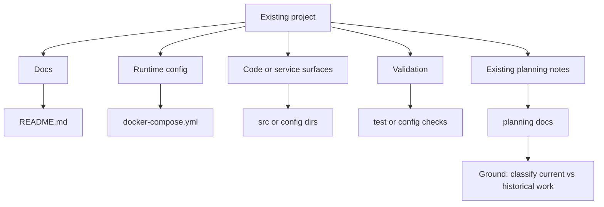

# Project Map: Example Existing Project

Status: example
Type: project-map
Updated: 2026-07-05
Next Action: none

## Purpose

Show the Level 2 onboarding shape for an existing project: first make the project visible, then use an inventory before creating deeper work artifacts.

## Visual Map

## Zoom Levels

30,000 ft:

- Overall outcome: understand the existing project well enough to choose useful next work.
- Success shape: a visual map and inventory show what exists, what is uncertain, and what should happen next.

10,000 ft:

- Major workstreams: docs, runtime/config, code/service surfaces, validation, existing planning notes.
- Key dependencies: front-door docs and observed files before inferred plans.

1,000 ft:

- Active workpackages: none by default at Level 2.
- Active tickets: none by default at Level 2.
- Open decisions: classify whether planning notes are active, historical, or settled docs.

Ground:

- Current next action: review the inventory and choose whether more backfill is justified.
- Verification: inventory separates observed facts from inferred follow-up.

## Workstreams

| Workstream | Status | Lead Artifact | Depends On | Next Action |
| --- | --- | --- | --- | --- |
| Docs | observed | `README.md` | none | Check whether docs are current |
| Runtime/config | observed | `docker-compose.yml` | environment values | Run available config validation |
| Existing planning | uncertain | `PLANNING.md` | human confirmation | Classify current vs historical role |

## Current Navigation

You are here:

- Level 2 onboarding has created a map and inventory.

Do next:

- [ ] Review the inventory.
- [ ] Decide whether any follow-up artifact is justified by evidence.

Avoid for now:

- Do not create workpackages, tickets, ADRs, or incidents from inference alone.

## Related Artifacts

- Workpackages:
- Tickets:
- Checklists:
- Spikes:
- ADRs:
- Runbooks:
- Inventories: `work/inventories/inventory-example-existing-project-surfaces.md`
- Decision matrices:
