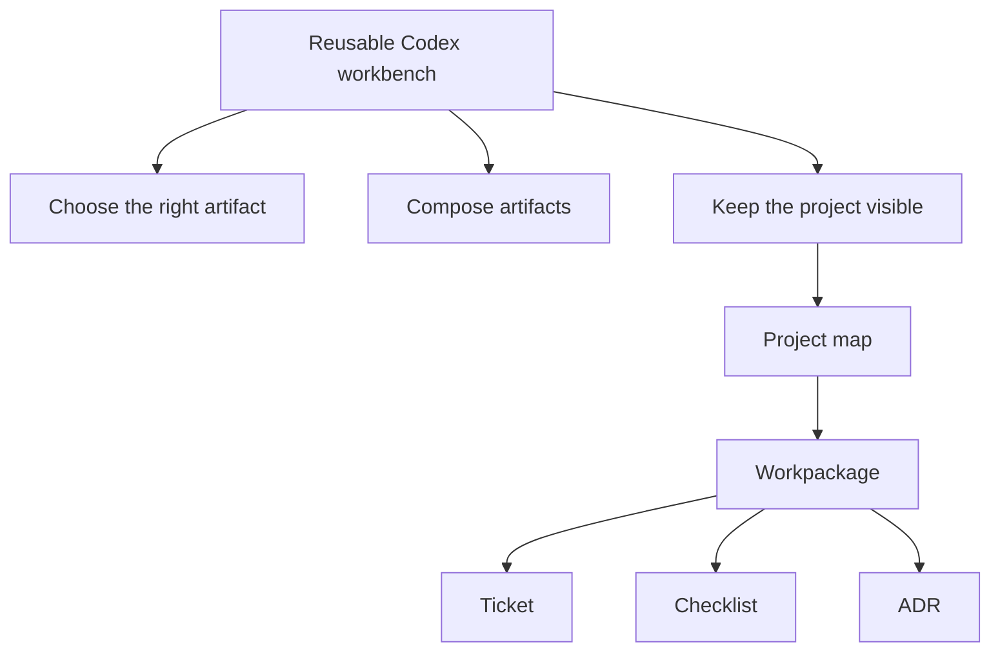

# Project Map: tool_shed Foundation

Status: example
Type: project-map
Updated: 2026-07-05
Next Action: none

## Purpose

Show how a project map helps a visual thinker move from the big project shape to the next ground-level action.

## Visual Map

## Zoom Levels

30,000 ft:

- Overall outcome: a reusable collaboration toolkit for structured Codex work.
- Success shape: Codex can orient, choose, execute, and preserve decisions without losing the larger picture.

10,000 ft:

- Major workstreams: selection, composition, visual coordination, installation, skill adoption, validation automation.
- Key dependencies: keep generated indexes, validation, and skill guidance aligned with local conventions.

1,000 ft:

- Active workpackages: `work/wp/active/...`
- Active tickets: `work/tickets/...`
- Open decisions: `work/decisions/...`

Ground:

- Current next action: choose the smallest artifact that moves the visible map forward.
- Verification: new artifacts link back to the map or parent workpackage.

## Workstreams

| Workstream | Status | Lead Artifact | Depends On | Next Action |
| --- | --- | --- | --- | --- |
| Selection | active | `selection.md` | none | Keep decision rules clear |
| Composition | active | `conventions.md` | stable headers | Link artifacts without duplication |
| Skill adoption | complete | `skills/tool-shed/SKILL.md` | stable foundation | Use on real projects |
| Validation automation | active | `scripts/validate_tool_shed.py` | script coverage | Keep CI green |

## Current Navigation

You are here:

- Building the visual coordination layer.

Do next:

- [ ] Create the map.
- [ ] Link active work to the map.
- [ ] Use the map to pick the next smaller artifact.

Avoid for now:

- Do not make a heavy tracker before Markdown and scripts fail.

## Related Artifacts

- Workpackages:
- Tickets:
- Checklists:
- Spikes:
- ADRs:
- Runbooks:
- Inventories:
- Decision matrices:
