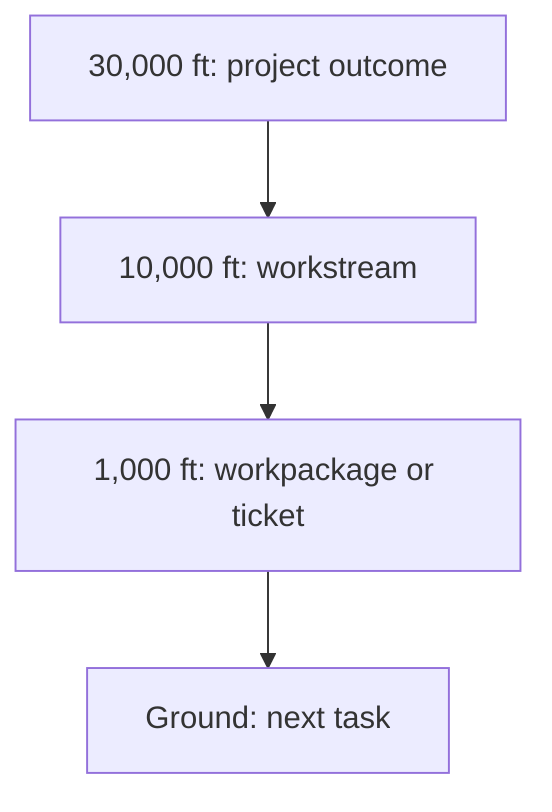

# Project Map: {{ title }}

Status: active
Type: project-map
Updated: {{ date }}
Next Action: map the main workstreams and current ground task

## Purpose

What project, effort, or moving system does this map help navigate?

## Visual Map

## Zoom Levels

30,000 ft:

- Overall outcome:
- Success shape:

10,000 ft:

- Major workstreams:
- Key dependencies:

1,000 ft:

- Active workpackages:
- Active tickets:
- Open decisions:

Ground:

- Current next action:
- Owner/context:
- Verification:

## Workstreams

| Workstream | Status | Lead Artifact | Depends On | Next Action |
| --- | --- | --- | --- | --- |
| ... | active/blocked/done | work/... | ... | ... |

## Dependency Notes

- ...

## Current Navigation

You are here:

- ...

Do next:

- [ ] ...

Avoid for now:

- ...

## Related Artifacts

- Workpackages:
- Tickets:
- Checklists:
- Spikes:
- ADRs:
- Runbooks:
- Inventories:
- Decision matrices:
