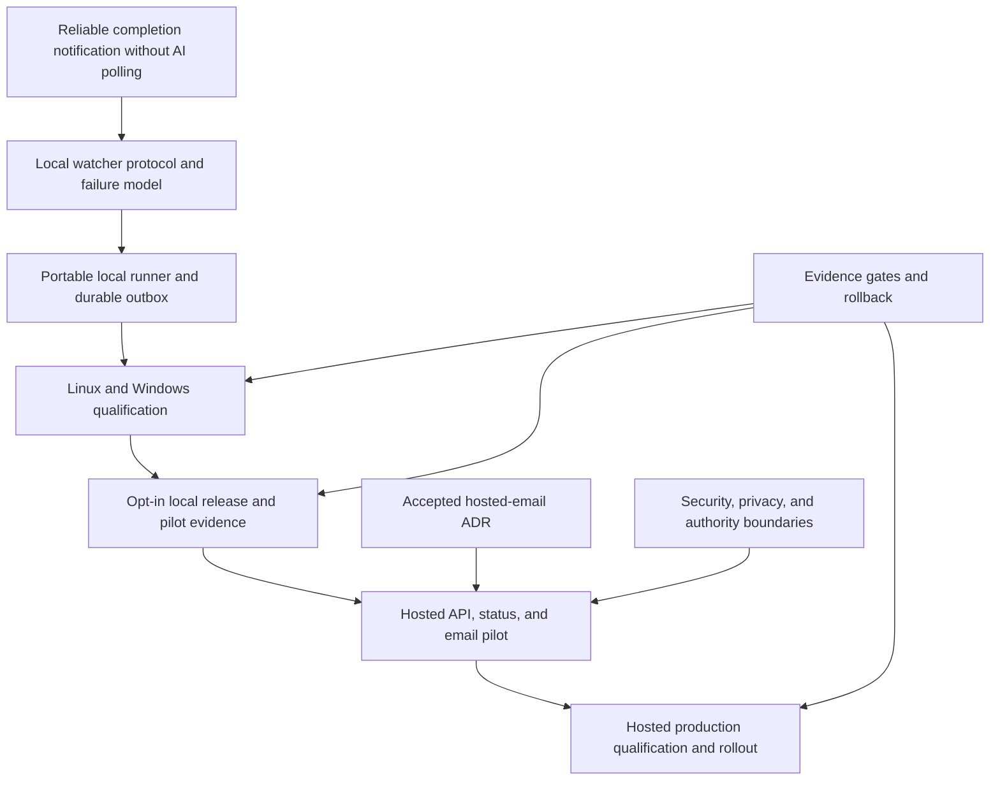

# Project Map: Disposable completion watchers and hosted notifications

Status: deferred
Type: project-map
Updated: 2026-08-18
Next Action: preserve the completed local watcher and wait for a concrete external/non-App-Server notification need before revisiting hosted work
Campaign: build-hosted-watcher-status-and-email-pilot

## Purpose

Coordinate the local watcher runtime, cross-platform qualification, optional hosted status and
email companion, release distribution, and evidence-driven rollout described by GitHub issue #42.
This map separates portable local truth from advisory hosted services and keeps implementation,
publication, deployment, and broader enablement behind distinct gates.

After qualified App Server integration, hosted scope excludes execution orchestration, App Server
monitoring, CAMP completion detection, recovery control, and agent lifecycle. Only advisory status
and notification delivery for external or non-App-Server work remain eligible.

## Visual Map

## Zoom Levels

30,000 ft:

- Overall outcome: long-running external work reaches a durable, low-token terminal notification
  path without making hosted infrastructure authoritative for local task state.
- Success shape: a portable one-minute watcher works and recovers on Linux and Windows; local
  installations can operate without the hosted service; opted-in workspaces can report sanitized
  status and delegate email delivery to an authenticated `ts.rookaro.com` backend.

10,000 ft:

- Major workstreams: protocol and failure model; local runner and outbox; cross-platform
  qualification; local release and pilot; hosted companion; security and privacy; production
  rollout and evidence.
- Key dependencies: the contract precedes implementation; local failure injection precedes public
  release; local release evidence precedes hosted pilot; hosted security and operational evidence
  precede broader notification enablement.

1,000 ft:

- Active workpackages: none.
- Campaigns 036 through 038 completed the local contract, implementation, qualification, and
  release; Campaign 035 remains deferred intake context and Campaign 039 remains deferred in
  reduced form.
- Open decisions apply only if hosted work is reactivated: concrete external workload, recipient,
  hosted technology, authentication, tenancy, retention, and operational ownership.

Ground:

- Current next action: none until a named external/non-App-Server workload and notification
  recipient justify reactivating reduced Campaign 039.
- Owner/context: human and Codex in the canonical Tool Shed maintainer workspace.
- Verification: M1 contract fixtures plus roadmap validation, queue reconciliation, index
  freshness, stale-path checks, and work-state review.

## Workstreams

| Workstream | Status | Lead Artifact | Depends On | Next Action |
| --- | --- | --- | --- | --- |
| Watch protocol and failure model | complete | `docs/completion-watcher-protocol.md` | issue #42 requirements | preserve the v1 contract and executable oracle |
| Portable local runner and outbox | complete | `scripts/completion_watcher.py` | approved protocol and failure-model gate | preserve the qualified local implementation |
| Linux and Windows qualification | complete | `work/evidence/evidence-completion-watcher-v1-release.md` | portable runner alpha | preserve cross-platform evidence |
| Local release and pilot | complete | `work/evidence/evidence-completion-watcher-v1-release.md` | cross-platform qualification | maintain the opt-in local capability |
| Hosted status and notification companion | deferred | `work/00-campaigns/deferred/039-build-hosted-watcher-status-and-email-pilot.md` | named external/non-App-Server workload and recipient | reassess only when a concrete independent need exists |
| Hosted production rollout | deferred | this map | reduced hosted pilot evidence and privacy/security review | do not materialize before a useful pilot passes |

## Dependency Notes

- The local watcher and durable outbox are required capabilities; hosted reporting remains
  optional and advisory.
- A reboot cannot be presented as automatically recoverable where no project heartbeat or other
  authorized recovery hook exists.
- Durable event ingestion and deduplicated processing do not imply unconditional exactly-once
  recipient delivery.
- The static documentation site and hosted backend must remain independently deployable and
  reversible even if they share `ts.rookaro.com` routing.
- No hosted credential, deployment, release, or production action is authorized by this map or its
  roadmap.

## Current Navigation

You are here:

- The v1 local watcher, contract, cross-platform qualification, and release evidence are complete.
- Qualified App Server execution owns in-path CAMP orchestration and completion behavior.
- The reduced hosted companion remains deferred with no current real pilot workload.

Do next:

- [x] Approve the Program Roadmap and complete M1 through M3.
- [x] Integrate the qualified App Server path and revise Campaign 039's boundary.
- [ ] If a real external/non-App-Server notification need appears, explicitly reactivate reduced
  Campaign 039 and bind the pilot to that workload and recipient.

Avoid for now:

- Do not execute campaign 035 as a single end-to-end implementation.
- Do not build the hosted backend without a concrete external/non-App-Server pilot need.
- Do not duplicate App Server orchestration, monitoring, recovery, or agent lifecycle.
- Do not deploy, publish, release, synchronize clients, or configure credentials from planning
  approval alone.

## Related Artifacts

- Work index: `work/index.md`
- Existing campaign: `work/00-campaigns/deferred/035-add-disposable-completion-watchers-and-hosted-status-reporting.md`
- Workpackages: none yet
- Tickets: none yet
- Checklists: `work/checklists/checklist-hosted-watcher-status-and-email-pilot.md` (deferred)
- Spikes: `work/spikes/spike-completion-watcher-protocol-and-failure-model.md`
- Protocol: `docs/completion-watcher-protocol.md`
- ADRs: `work/adr/adr-centralize-watcher-email-delivery-at-ts-rookaro-com.md`
- Runbooks: hosted and local operational runbooks are later milestone outputs
- Inventories: none
- Decision matrices: none
- External request: https://github.com/PC-Redemption/tool_shed/issues/42
