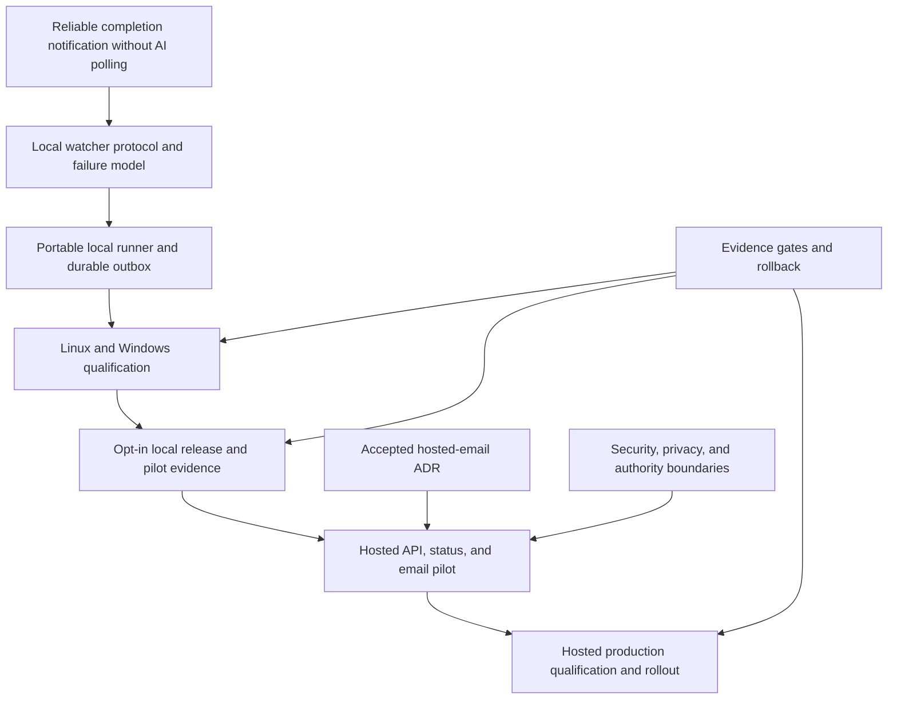

# Project Map: Disposable completion watchers and hosted notifications

Status: active
Type: project-map
Updated: 2026-08-18
Next Action: derive and approve the M2 local-alpha campaign after G1 contract evidence is recorded
Campaign: standalone
Campaign Reason: strategic coordination surface; executable work will be materialized from an approved Program Roadmap

## Purpose

Coordinate the local watcher runtime, cross-platform qualification, optional hosted status and
email companion, release distribution, and evidence-driven rollout described by GitHub issue #42.
This map separates portable local truth from advisory hosted services and keeps implementation,
publication, deployment, and broader enablement behind distinct gates.

## Visual Map

## Zoom Levels

30,000 ft:

- Overall outcome: long-running external work reaches a durable, low-token terminal notification
  path without making hosted infrastructure authoritative for local task state.
- Success shape: a portable one-minute watcher works and recovers on Linux and Windows; local
  installations can operate without the hosted service; opted-in workspaces can report sanitized
  status and delegate email delivery to an authenticated `ts.rookaro.com` backend.

10,000 ft:

- Major workstreams: protocol and failure model; local runner and outbox; cross-platform
  qualification; local release and pilot; hosted companion; security and privacy; production
  rollout and evidence.
- Key dependencies: the contract precedes implementation; local failure injection precedes public
  release; local release evidence precedes hosted pilot; hosted security and operational evidence
  precede broader notification enablement.

1,000 ft:

- Active workpackages: none; M1 was a bounded contract spike rather than runner implementation.
- Active campaigns: roadmap-derived Campaign 036 records the completed M1 contract; deferred
  campaign 035 remains intake context and must not execute as an umbrella campaign.
- Open decisions: hosted technology, authenticated UI, tenancy, retention, and operational
  ownership remain for later milestones. Local v1 watcher semantics are frozen.

Ground:

- Current next action: derive and separately approve the M2 local-alpha campaign plan.
- Owner/context: human and Codex in the canonical Tool Shed maintainer workspace.
- Verification: M1 contract fixtures plus roadmap validation, queue reconciliation, index
  freshness, stale-path checks, and work-state review.

## Workstreams

| Workstream | Status | Lead Artifact | Depends On | Next Action |
| --- | --- | --- | --- | --- |
| Watch protocol and failure model | complete | `docs/completion-watcher-protocol.md` | issue #42 requirements | preserve the v1 contract and executable oracle |
| Portable local runner and outbox | planned | this map | approved protocol and failure-model gate | derive and approve the M2 campaign |
| Linux and Windows qualification | planned | this map | portable runner alpha | run concurrency, crash, reboot, missing-target, and outage scenarios |
| Local release and pilot | planned | this map | cross-platform qualification | release opt-in local capability and capture pilot evidence |
| Hosted status and email companion | planned | `work/adr/adr-centralize-watcher-email-delivery-at-ts-rookaro-com.md` | local outbox contract and local release evidence | settle hosted architecture and run a bounded pilot |
| Hosted production rollout | planned | this map | hosted pilot evidence and privacy/security review | qualify independent deployment, rollback, retention, and notification behavior |

## Dependency Notes

- The local watcher and durable outbox are required capabilities; hosted reporting remains
  optional and advisory.
- A reboot cannot be presented as automatically recoverable where no project heartbeat or other
  authorized recovery hook exists.
- Durable event ingestion and deduplicated processing do not imply unconditional exactly-once
  recipient delivery.
- The static documentation site and hosted backend must remain independently deployable and
  reversible even if they share `ts.rookaro.com` routing.
- No hosted credential, deployment, release, or production action is authorized by this map or its
  roadmap.

## Current Navigation

You are here:

- The v1 local watcher contract, schemas, and executable oracle are complete. Production runner
  behavior remains unimplemented and belongs to M2.

Do next:

- [x] Approve the Program Roadmap and materialize M1.
- [x] Freeze the v1 protocol and record G1 evidence.
- [ ] Derive and separately approve the M2 local-alpha campaign plan.

Avoid for now:

- Do not execute campaign 035 as a single end-to-end implementation.
- Do not build the hosted backend before local lifecycle and outbox evidence pass their gate.
- Do not deploy, publish, release, synchronize clients, or configure credentials from planning
  approval alone.

## Related Artifacts

- Work index: `work/index.md`
- Existing campaign: `work/00-campaigns/deferred/035-add-disposable-completion-watchers-and-hosted-status-reporting.md`
- Workpackages: none yet
- Tickets: none yet
- Checklists: none yet
- Spikes: `work/spikes/spike-completion-watcher-protocol-and-failure-model.md`
- Protocol: `docs/completion-watcher-protocol.md`
- ADRs: `work/adr/adr-centralize-watcher-email-delivery-at-ts-rookaro-com.md`
- Runbooks: hosted and local operational runbooks are later milestone outputs
- Inventories: none
- Decision matrices: none
- External request: https://github.com/PC-Redemption/tool_shed/issues/42
