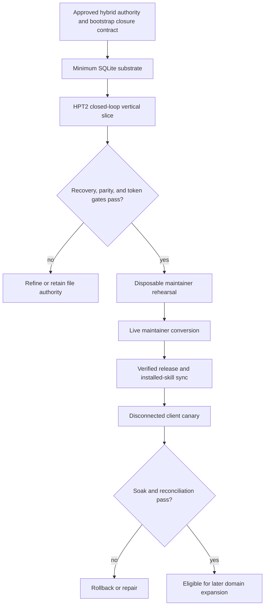

# Project Map: Hybrid SQLite Operational State

Status: approved
Type: project-map
Updated: 2026-08-28
Next Action: follow the approved Program Roadmap beginning with its bootstrap/design milestone
Campaign: standalone
Campaign Reason: this map coordinates roadmap-derived milestones and is not owned by one execution campaign

## Purpose

Introduce a hybrid SQLite-backed operational-state layer that removes path-coupled identity,
reduces state-heavy agent context, and enables universal closed-loop outcome reconciliation without
losing imported material, Git-reviewable history, recovery, provider portability, or upgrade
safety.

## Visual Map

## Zoom Levels

30,000 ft:

- Overall outcome: Tool Shed owns minimum relational operational state in a local ignored SQLite
  database while files remain authoritative for imports, product truth, compact projections,
  deterministic checkpoints, and recovery.
- Success shape: immutable IDs and guarded transactions support one complete idea-to-product loop;
  exact file and semantic preservation, fresh-clone rebuild, rollback, direct-SQL detection, local
  Git operation without GitHub or `gh`, and at least 70% median context reduction all pass before
  broader database authority.

10,000 ft:

- Major workstreams: bootstrap closed-loop enforcement; authority/checkpoint/schema decisions;
  minimum SQLite substrate; HPT2 reconciliation; no-data-loss migration; performance and recovery
  qualification; maintainer-first rollout; released client canary.
- Key dependencies: existing project identity and state-token fencing, Git-backed work history,
  snapshot updater and release provenance, SQLite standard-library support, current validators, and
  the separate universal closed-loop Idea Brief.

1,000 ft:

- Active workpackages: none; roadmap milestones will create bounded campaigns directly.
- Active tickets: none.
- Open decisions: exact checkpoint/event serialization, phase-one entity/field authority, schema
  and trigger contract, bootstrap manifest representation, merge-conflict policy, updater protocol
  version, backup/soak thresholds, and downgrade compatibility.

Ground:

- Current next action: follow the approved staged Program Roadmap beginning with its
  bootstrap/design milestone, without beginning database authority cutover prematurely.
- Owner/context: this is a consequential conversion of Tool Shed's state architecture; the new
  closed-loop feature cannot be its own initial completion authority, and the canonical maintainer
  uses a special Git-development path rather than its client snapshot updater.
- Verification: bootstrap reconciliation; byte and semantic parity; SQLite integrity and foreign
  keys; interruption, branch/worktree, backup, rebuild, reverse-export, and rollback tests; HPT2
  outcome parity; 70% median context reduction with no more than 5% explained full-scan fallback;
  Windows/POSIX release qualification; maintainer and disconnected-client canary evidence.

## Workstreams

| Workstream | Status | Lead Artifact | Depends On | Next Action |
| --- | --- | --- | --- | --- |
| Bootstrap closure and design freeze | proposed | work/ideas/idea-sqlite-backed-tool-shed-operational-state.md | Approved project direction | Freeze authority, schema, checkpoint, migration, and independent closure contracts |
| Minimum SQLite substrate | proposed | work/ideas/idea-sqlite-backed-tool-shed-operational-state.md | Bootstrap/design gate | Implement IDs, imports, relationships, revisions/events, migration/export ledgers, and guarded access |
| HPT2 closed-loop vertical slice | proposed | work/ideas/idea-universal-closed-loop-outcome-reconciliation.md | Minimum substrate | Import HPT2 and reproduce a complete origin-to-product reconciliation |
| Recovery and efficiency qualification | proposed | work/ideas/idea-sqlite-backed-tool-shed-operational-state.md | Vertical slice | Prove rebuild, rollback, branch/worktree safety, direct-SQL handling, and token/context gates |
| Maintainer-first conversion | proposed | work/ideas/idea-sqlite-backed-tool-shed-operational-state.md | Qualification gate | Rehearse externally, then convert the canonical maintainer with all original files retained |
| Release and client canary | proposed | work/ideas/idea-sqlite-backed-tool-shed-operational-state.md | Maintainer soak | Publish, synchronize the installed skill, and qualify one disconnected production-shaped client |

## Dependency Notes

- Phase one owns identities, imports/hashes, typed relationships, revisions/events, evidence
  references, migration/export/checkpoint ledgers, and minimum closed-loop records only.
- Campaign, roadmap, and milestone authority; general Markdown body storage; broad index replacement;
  and legacy-file retirement remain outside phase one.
- The ignored database is working state. Deterministic tracked checkpoints/events are reviewed,
  portable history and the collaboration surface; every worktree owns a separate database.
- Supported writes use domain scripts or a shared state library. Database-enforced revision and
  dirty-state accounting detects bypass SQL; managed entrance audits never silently bless it.
- The file/Git bootstrap closure harness remains independent until the database-backed vertical
  slice imports its exact history and reproduces the same verdict.
- The production contract requires local Git but not a GitHub remote, authenticated `gh`, MCP,
  App Server, a database server, or cloud services.
- The existing unfinished persistent-autonomy release milestone is a separate program. This map
  does not reorder or abandon it.

## Current Navigation

You are here:

- The Idea Brief direction is coherent and explicitly promoted into this map.

Do next:

- [x] Approve this map under the active planning authority envelope.
- [ ] Follow the approved Program Roadmap and begin with its bootstrap/design milestone.
- [ ] Resolve sequencing against the unfinished persistent-autonomy release milestone before
  materializing a new execution campaign.

Avoid for now:

- Do not implement the full database before the bootstrap closure and phase-one design gate.
- Do not migrate the live maintainer before a disposable rehearsal and verified rollback.
- Do not retire legacy files, broaden database authority, publish, synchronize skills, or upgrade
  clients merely because the PRM artifacts exist.
- Do not make GitHub or `gh` a production runtime dependency.

## Related Artifacts

- Work index: work/index.md
- Source Idea Brief: work/ideas/idea-sqlite-backed-tool-shed-operational-state.md
- Closed-loop Idea Brief: work/ideas/idea-universal-closed-loop-outcome-reconciliation.md
- Program Roadmap: work/roadmaps/roadmap-hybrid-sqlite-operational-state.md
- Maintainer release procedure: docs/releasing.md
- Snapshot upgrade contract: docs/install-or-update-snapshot.md
- Performance protocol: docs/workspace-performance-profiling.md
