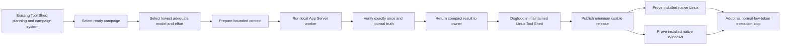

# Project Map: Low-token cross-platform campaign execution

Status: active
Type: project-map
Updated: 2026-08-25
Next Action: materialize and execute the pre-authorized M2 release and maintainer-skill campaigns; stop before any Core snapshot or skill change
Campaign: standalone
Campaign Reason: source coordination surface for a gated Program Roadmap; campaign materialization awaits exact roadmap approval

## Purpose

Extend the already-developed Tool Shed with a practical App Server execution layer that lets Tool
Shed select the lowest adequate model and effort, provide bounded context, execute and verify a
campaign with minimal owner intervention, and return a compact truthful result. Dogfood the path in
the canonical maintained Linux workspace, then distribute and prove the same operator experience in
installed native Linux and Windows workspaces.

This is a pre-commercial, owner-utility program. Real useful execution is the primary evidence.
Testing remains smart and proportional: focused checks during repair, one full deterministic suite
at the release boundary, and one representative native workflow per supported platform.

## Standing Owner Authorization

Effective 2026-08-25, this directive applies to the complete
`low-token-cross-platform-campaign-execution` Program Roadmap until the owner changes or revokes it.

The following M2 actions are pre-authorized and must not be presented as separate owner approval
gates:

- materialize the exact M2 campaign plan derived from approved Roadmap Revision 1;
- execute `publish-minimum-usable-tool-shed-v0-28-0`, including its declared validation, local
  commits, annotated tag, branch/tag push, and verified non-draft GitHub release; and
- execute `synchronize-maintainer-skill-and-smoke-v0-28-0`, including its bounded backup,
  installed-skill replacement, exact-parity check, and fresh-session smoke.

This standing authorization does not authorize any Tool Shed snapshot or installed-skill change in
`E:\dev\bactron-core`. The M4 Core upgrade and its Windows execution remain a hard owner-consent
gate. It also does not authorize Bactron application deployment, credential changes, destructive
recovery, new external targets, or material expansion beyond the named campaign requests. Normal
safety, evidence, dependency, and fail-closed boundaries remain active. When an authorized M2 step
passes, continue to the next authorized M2 step without requesting another approval.

## Visual Map

## Zoom Levels

30,000 ft:

- Overall outcome: one Tool Shed command can complete the next appropriate campaign on native Linux
  or Windows through the lowest adequate qualified model, while consuming materially less owner
  attention and foreground-session context than GUI-managed execution.
- Success shape: the canonical maintained Tool Shed and installed Linux and Windows workspaces each
  complete a real bounded App Server campaign; Tool Shed selects the intended role/model, preserves
  work safely, verifies truthfully, reports token/turn/time metrics, and gives one recovery action
  when a controlled failure occurs.

10,000 ft:

- Shared core: campaign selection, role/model policy, context bounding, App Server protocol,
  allowlists, mutation journal, exactly-once verification, metrics, and compact outcomes.
- Native adapters: Linux and Windows executable discovery, path handling, process/stdio behavior,
  launchers, installed-skill replacement, backups, rollback, and platform-specific diagnostics.
- Delivery path: maintained-workspace dogfood, minimum usable release, installed Linux proof,
  installed Windows proof, then owner adoption.
- Key dependency: real local dogfood precedes publication; a published release precedes installed
  workspace proofs; observed failures are repaired inside the milestone that exposed them.

1,000 ft:

- Existing capability: Tool Shed already provides plans, roadmaps, campaigns, safety boundaries,
  versioned snapshots, installers, skill synchronization, App Server routing, token telemetry, and
  a two-turn optimized CAMP path.
- Completed enabling work: Campaign 040 proved material App Server token/turn reduction; Campaigns
  041 through 053 integrated and qualified routing, compatibility, executable resolution, and
  snapshot delivery; Campaign 054 repaired the generic verification handoff.
- Current limiting condition: the repaired path has not completed the simple dogfood-to-release-to-
  native-install loop, so the owner still cannot rely on it for everyday campaign execution.
- Open measurement: report raw input, cached input, output, weighted usage, model turns, elapsed
  time, and owner interactions separately; do not claim a GUI token comparison that the GUI cannot
  expose.

Ground:

- Current next action: materialize the already-derived M2 plan and execute its release and
  maintainer-skill campaigns in dependency order under the standing owner authorization above.
- Owner/context: human owner and Codex in `/home/jon/docker/tool_shed`; native Windows proof occurs
  through a normally launched Codex GUI on the work PC in `E:\dev\bactron-core`.
- Verification: focused changed-path tests plus one real dogfood run during development; one full
  Tool Shed validator at the stable release boundary; one installation/update smoke and real bounded
  campaign on each native platform; no repeated full validation when relevant inputs are unchanged.

## Workstreams

| Workstream | Status | Lead Artifact | Depends On | Next Action |
| --- | --- | --- | --- | --- |
| Existing Tool Shed control plane | complete | current Tool Shed source and `work/` lifecycle | completed foundation and evolution work | preserve; do not redesign |
| App Server shared execution core | implemented, needs real dogfood | `scripts/app_server_control.py` and related adapters | Campaigns 040-054 | run one useful maintained-workspace campaign and repair only observed failures |
| Lean qualification policy | planned | proposed roadmap gates | owner dogfood-first decision | enforce focused-development, single-release-suite, and native-real-use gates |
| Minimum usable release | planned | proposed milestone `M2-MINIMUM-RELEASE` | successful maintained-workspace dogfood | publish and synchronize the proven candidate |
| Installed native Linux | planned | proposed milestone `M3-LINUX-INSTALLED` | verified release | install or upgrade and complete one real campaign |
| Installed native Windows | planned | proposed milestone `M4-WINDOWS-INSTALLED` | verified release | upgrade Core and complete one real asset-aware campaign |
| Owner operating loop | planned | proposed milestone `M5-ADOPTION` | both native proofs | publish exact usage and recovery path, then use it for ordinary campaigns |

## Dependency Notes

- App Server is an execution adapter. Tool Shed remains authoritative for project state, campaign
  selection, lifecycle transitions, verification decisions, and the next action.
- Model selection alone changes weighted usage; bounded context, compact deterministic evidence,
  fewer turns, and no GUI transcript carryover reduce raw tokens.
- The common core must not fork by operating system. Native differences stay behind narrow Linux
  and Windows adapters and receive only their relevant focused tests.
- Hard blockers are limited to unsafe/dirty declared targets, unqualified exact executables,
  authentication or no-API-fallback violations, failed declared correctness checks, and ambiguous
  post-mutation journal state.
- Historical evidence warnings, optional metrics, documentation polish, exhaustive compatibility
  matrices, and unrelated checks are warnings or later work unless they block the real path.
- On ordinary failure, preserve evidence, repair in the same campaign, rerun the failed focused
  check, and run one end-to-end smoke. Do not create a detour campaign or repeat unchanged suites.
- Native per-host operation is the first boundary. Central remote dispatch, macOS qualification,
  hosted services, and commercial-scale support are later decisions.

## Current Navigation

You are here:

- The App Server mechanism and its major repairs exist in the maintained Tool Shed candidate.
- The missing work is a short outcome loop: dogfood it locally, release it once, prove it on native
  installed Linux and Windows, and start using it.

Do next:

- [x] Approve the exact outcome-driven Program Roadmap proposal.
- [x] Derive, approve, and complete the maintained-Linux dogfood campaign.
- [x] Attempt that campaign through App Server; repair observed failures without opening new fires.
- [ ] Materialize and execute the pre-authorized v0.28.0 release campaign.
- [ ] Execute the pre-authorized maintainer installed-skill synchronization and fresh-session smoke.
- [ ] Prove the released installed path on native Linux and Windows.
- [ ] Adopt the command for ordinary campaign execution and track actual savings.

Avoid for now:

- Do not redesign Tool Shed's planning or campaign system.
- Do not build another orchestrator, hosted service, remote dispatcher, or operating-system fork.
- Do not require commercial-grade compatibility matrices before owner use.
- Do not replay Bactron Core Campaign 013 or deploy the Bactron application.
- Do not silently fall back from explicitly requested App Server execution to GUI execution.

## Related Artifacts

- Work index: `work/index.md`
- App Server optimization: `work/00-campaigns/completed/040-app-server-camp-token-optimization.md`
- App Server integration: `work/00-campaigns/completed/041-integrate-qualified-app-server-and-reassess-hosted-watcher.md`
- Explicit routing and readiness: `work/00-campaigns/completed/044-app-server-explicit-command-opt-in.md`, `work/00-campaigns/completed/045-resolve-codex-cli-and-report-app-server-readiness.md`, `work/00-campaigns/completed/046-forward-next-app-server-to-qualified-camp-execution.md`
- Compatibility and forward qualification: `work/00-campaigns/completed/049-implement-minimum-version-dirty-read-qualification.md`, `work/00-campaigns/completed/050-make-codex-candidate-resolution-and-readiness-truthful.md`, `work/00-campaigns/completed/051-harden-dirty-qualification-cache-and-failure-semantics.md`, `work/00-campaigns/completed/052-qualify-release-and-field-verify-dirty-codex-forward-compatibility.md`
- Snapshot delivery: `work/00-campaigns/completed/053-make-stable-snapshot-upgrades-fast-observable-and-retry-safe.md`
- Verification handoff repair: `work/00-campaigns/completed/054-harden-app-server-camp-verification-handoff.md`
- Standing owner authorization: this map's `Standing Owner Authorization` section
- Bactron Core enabling work: Campaign 014 in `E:\dev\bactron-core`
