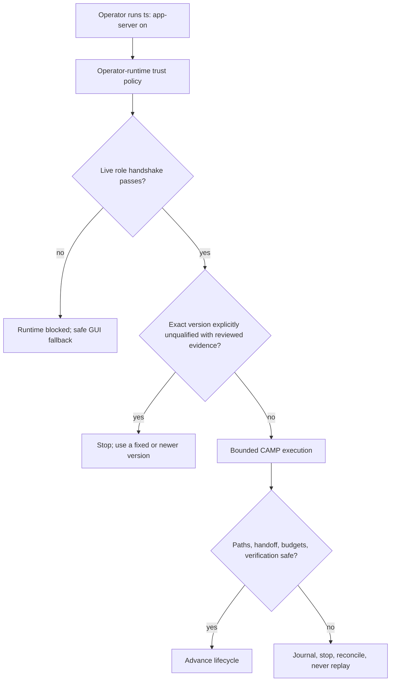

# Project Map: Operator-Trust CAMP Runtime Enforcement

Status: approved
Type: project-map
Updated: 2026-08-27
Next Action: develop an exact Program Roadmap proposal
Campaign: standalone
Campaign Reason: this map coordinates roadmap-derived campaigns and is not owned by one execution campaign

## Purpose

Replace Codex identity-based CAMP admission with explicit operator trust plus live behavioral
enforcement, while preserving the existing Git, path, journal, budget, deterministic verification,
reconciliation, no-replay, project identity, endpoint, and external-authority boundaries.

## Visual Map

## Zoom Levels

30,000 ft:

- Overall outcome: unknown and newly updated Codex CLIs may perform supported local CAMP writes
  after a live capability handshake, without an exact-version allowlist entry.
- Success shape: version and executable hash remain visible telemetry; runtime readiness and
  observed safety determine local backend access; optional exact certification remains available
  only for explicitly strict workspaces.

10,000 ft:

- Major workstreams: trust/preference migration; the existing live capability and containment path;
  minimal reviewed exact-version denial; optional strict certification; status, tests, and documentation.
- Key dependencies: the existing resolver, App Server selector, CAMP runner, mutation journal,
  preparation capsule, model policy, autonomy/project binding, and GUI fallback contract.

1,000 ft:

- Active workpackages: none; the Program Roadmap will create milestone-scoped campaigns directly.
- Active tickets: none.
- Settled direction: rerunning `ts: app-server on` records fresh operator-runtime consent; legacy
  `on` does not silently gain CAMP-write meaning; strict certification is workspace policy; each
  operation uses the existing startup/authentication/model/sandbox and bounded CAMP path; only an
  exact `unqualified` registry record with reviewed evidence denies a version.
- Implementation detail still to prove: whether diagnostic capability caching retains enough
  value to keep.

Ground:

- Current next action: approve this exact map, propose one local-candidate roadmap milestone, and
  derive its bounded campaigns.
- Owner/context: frequent Codex releases should not create qualification and Tool Shed release work
  when relevant behavior remains compatible.
- Verification: unknown-version admission under fresh consent; live-gate failure before mutation;
  strict-mode exact-certification refusal; exact reviewed denial and fixed-version recovery; unexpected-path,
  malformed-handoff, interruption, and failed-verification recovery; unchanged protected-operation
  boundaries; focused tests plus the repository validator on the frozen local candidate.

## Workstreams

| Workstream | Status | Lead Artifact | Depends On | Next Action |
| --- | --- | --- | --- | --- |
| Trust policy and migration | proposed | work/ideas/idea-operator-trust-runtime-enforcement-for-camp.md | Existing user-local preference | Introduce fresh operator-runtime consent and explicit legacy status |
| Runtime readiness and CAMP admission | proposed | work/ideas/idea-operator-trust-runtime-enforcement-for-camp.md | Resolver, selector, existing runtime path | Prove unknown-version CAMP end to end without adding a parallel handshake |
| Safety observation and recovery | proposed | work/ideas/idea-operator-trust-runtime-enforcement-for-camp.md | Existing registry, mutation journal, and no-replay contract | Reuse evidence-backed exact `unqualified` records as the only normal-mode version denial |
| Strict certification and retirement | proposed | work/ideas/idea-operator-trust-runtime-enforcement-for-camp.md | Existing registry, hash checks, harness, dirty-read cache | Reposition machinery without deleting historical evidence |
| Qualification and operator contract | proposed | work/ideas/idea-operator-trust-runtime-enforcement-for-camp.md | Integrated local candidate | Prove safety boundaries and align help, skill, execution, maintainer, and migration docs |

## Dependency Notes

- `ts: app-server on` is backend trust, not task authority. Requested work1-work5 endpoints,
  project identity, autonomy, provider controls, credentials, destructive operations,
  cross-workspace actions, deployment, production, publication, and release remain independent.
- The existing qualification registry becomes optional strict-certification evidence, reviewed
  compatibility history, and the minimal evidence-backed exact-version denylist. Executable hashes
  remain diagnostic evidence, never the normal permission gate.
- The disposable write harness remains for strict environments, release qualification, regression
  reproduction, and unsafe-behavior investigation; it is not run merely because Codex changed.
- The dirty-read cache cannot authorize a current run. Retain only advisory discovery value that
  survives a KISS review; otherwise retire it without deleting historical user-local state during
  migration.
- The first program boundary is a tested, documented, locally frozen candidate. It excludes push,
  tag, release, installed-skill synchronization, downstream snapshot upgrade, deployment, and
  production publication.

## Current Navigation

You are here:

- This approved map faithfully captures the promoted Idea Brief and selects the minimum decisions
  needed to plan a local candidate.

Do next:

- [x] Approve this map under the active planning authority envelope.
- [ ] Propose and approve one Program Roadmap milestone for the local candidate.
- [ ] Derive and materialize only that milestone's campaigns before source execution.

Avoid for now:

- Do not publish, push, release, deploy, synchronize installed skills, upgrade downstream
  workspaces, weaken mutation containment, or reinterpret runtime failures as unsafe behavior.

## Related Artifacts

- Work index: work/index.md
- Idea Brief: work/ideas/idea-operator-trust-runtime-enforcement-for-camp.md
- Passive routing foundation: work/maps/map-passive-app-server-dogfooding.md
- App Server execution foundation: work/maps/map-low-token-cross-platform-campaign-execution.md
- Current command contract: skills/tool-shed/references/campaign-routes.md
- Current runtime documentation: docs/codex-app-server-execution.md
