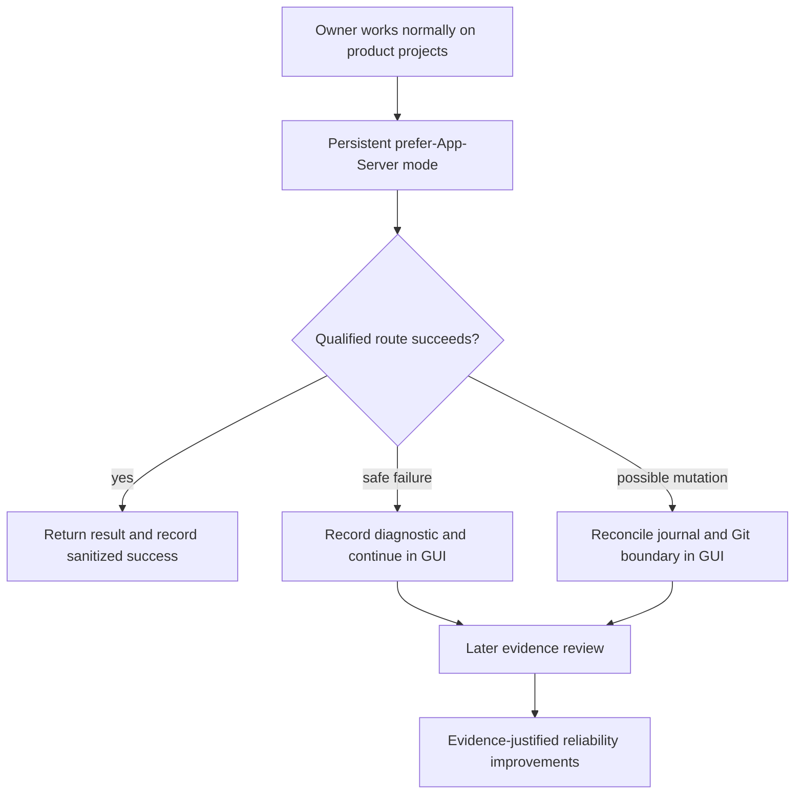

# Project Map: Passive App Server Dogfooding

Status: superseded
Type: project-map
Updated: 2026-08-27
Next Action: none
Superseded By: work/maps/map-operator-trust-camp-runtime-enforcement.md
Campaign: standalone
Campaign Reason: this approved map coordinates multiple roadmap-derived campaigns and is not owned by one execution campaign

## Purpose

Turn qualified Codex App Server execution from a repeatedly typed opt-in into a passive,
user-controlled Tool Shed preference that learns from real product work without interrupting it.
This direction extends the completed low-token cross-platform execution program from proven
explicit operation into low-friction owner adoption.

## Visual Map

## Zoom Levels

30,000 ft:

- Overall outcome: one persistent owner choice makes eligible Tool Shed routes prefer App Server
  while recoverable backend failures become passive diagnostics instead of workflow interruptions.
- Success shape: product work continues in the same action, strict mutation safety is preserved,
  and sanitized field evidence supports later Tool Shed improvements without immediate detours.

10,000 ft:

- Major workstreams: persistent preference and routing; mutation-aware fallback and event capture;
  field adoption and evidence-responsive improvements.
- Key dependencies: existing qualified role/model policy, deterministic selector and dispatcher,
  user-local Codex-home storage, mutation journal, installed-skill synchronization, and the
  completed cross-platform App Server execution foundation.

1,000 ft:

- Active workpackages: none; PRM will create milestone-scoped campaigns directly.
- Active tickets: none.
- Open decisions: per-project overrides, aggregate reporting, and circuit-breaking remain deferred
  until M1 field evidence demonstrates a concrete need.

Ground:

- Current next action: approve this exact map and propose the smallest Program Roadmap whose M1
  delivers passive dogfooding core behavior.
- Owner/context: the owner needs Tool Shed learning to occur during normal product development
  without repetitive flags or recurring Tool Shed repair detours.
- Verification: deterministic preference/routing tests, safe fallback boundary tests, privacy-safe
  event-schema tests, status output, installer/snapshot checks, and one installed-workspace smoke.

## Workstreams

| Workstream | Status | Lead Artifact | Depends On | Next Action |
| --- | --- | --- | --- | --- |
| Persistent preference and routing | proposed | work/ideas/idea-passive-app-server-dogfooding-mode.md | Existing qualified App Server selector | Deliver user-local on/off/status and effective-route precedence |
| Safe fallback and flight recorder | proposed | work/ideas/idea-passive-app-server-dogfooding-mode.md | Mutation journal and GUI continuation contract | Prove pre-mutation fallback and mutation-aware reconciliation without replay |
| Field learning and improvement | proposed | work/ideas/idea-passive-app-server-dogfooding-mode.md | Released M1 core used in real projects | Review accumulated evidence before adding reports or circuit breakers |

## Dependency Notes

- The completed `work/maps/map-low-token-cross-platform-campaign-execution.md` remains historical
  foundation; this map owns the new adoption and passive-learning direction rather than reopening
  its completed milestones.
- M1 must be independently useful: preference, fallback, minimal sanitized events, status, tests,
  and documentation. Analytics, circuit breakers, dashboards, services, and automatic repairs are
  not dependencies for M1.
- User-local writes and diagnostic-write failures must never expand repository mutation scope or
  prevent a safe GUI fallback.

## Current Navigation

You are here:

- Project-map direction is proposed and awaiting exact owner approval.

Do next:

- [ ] Approve this project-map token.
- [ ] Propose and approve the passive-dogfooding Program Roadmap.
- [ ] Derive and exactly approve only the M1 campaign plan.

Avoid for now:

- Do not implement the feature, publish a release, synchronize clients, or add reporting analytics
  while the PRM and M1 campaign plan remain unapproved.

## Related Artifacts

- Work index: work/index.md
- Idea Brief: work/ideas/idea-passive-app-server-dogfooding-mode.md
- Prior foundation: work/maps/map-low-token-cross-platform-campaign-execution.md
- Current App Server policy: docs/codex-app-server-maintainer-note.md
- Current command contract: skills/tool-shed/references/campaign-routes.md
