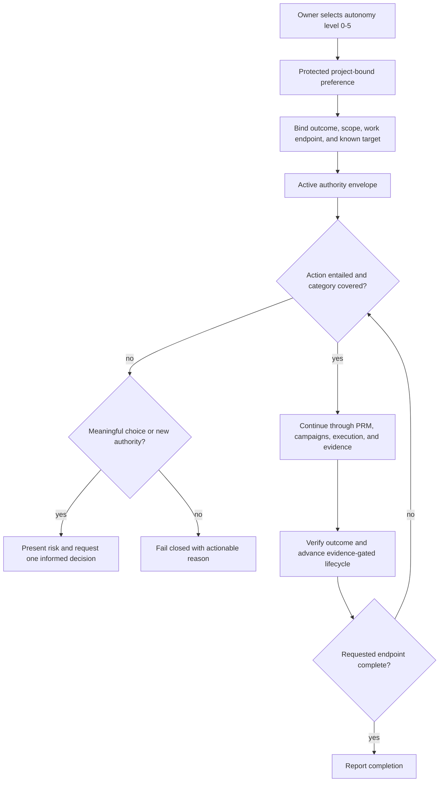

# Project Map: Persistent Autonomy Levels

Status: approved
Type: project-map
Updated: 2026-08-27
Next Action: develop an exact Program Roadmap proposal
Campaign: standalone
Campaign Reason: proposed PRM direction; later roadmap-derived campaigns will own execution

## Purpose

Coordinate a persistent, project-bound Tool Shed authority envelope that removes ceremonial
approval throughout planning, roadmap, milestone, campaign-materialization, execution, evidence,
and delivery cycles after the owner says `go`, while preserving task scope, work1-work5 endpoints,
known-target boundaries, and provider-native safety controls.

## Visual Map

## Zoom Levels

30,000 ft:

- Overall outcome: Tool Shed combines one persistent owner preference with the requested outcome,
  work endpoint, known target, and provider policy to form an explicit authority envelope.
- Success shape: zero additional Tool Shed approvals after `go` while remaining actions stay inside
  the envelope; artifact and phase transitions are automatic; malformed or foreign state fails
  safely; genuine authority and safety boundaries remain explicit.

10,000 ft:

- Major workstreams: authority-envelope taxonomy and precedence; protected persistence and identity
  binding; automatic PRM and campaign lifecycle; execution and delivery integration; meaningful
  interrupt presentation; cross-provider validation, documentation, and release qualification.
- Key dependencies: project identity, work1-work5 endpoint resolution, existing campaign
  continuity rules, provider adapter capability boundaries, and the proven user-local App Server
  preference pattern.

1,000 ft:

- Active workpackages: none; roadmap revision 2 will derive milestone-scoped campaigns after the
  revised direction is approved under the current contract.
- Active tickets: none.
- Open decisions: canonical command naming; exact category boundaries; project-only versus optional
  global scope; duration of levels 4-5; recoverable deletion and external-message classification;
  bare PRM endpoint behavior; and how to classify faithful automatic acceptance versus a material
  product, architecture, sequencing, or target choice.

Ground:

- Current next action: approve this revised map, then propose roadmap revision 2 around one
  end-to-end authority envelope rather than separate artifact approvals.
- Owner/context: repetitive pauses after explicit `go` are the observed problem; the earlier map
  preserved separate exact project-map, roadmap, and campaign-plan gates and therefore captured the
  idea too narrowly.
- Verification: deterministic level/category/precedence tables; automatic phase and artifact
  transition scenarios; malformed, stale, and foreign-state tests; meaningful-interrupt and inline
  risk-presentation tests; provider conformance; full Linux and Windows repository validation; and
  installed-workspace smoke before release.

## Workstreams

| Workstream | Status | Lead Artifact | Depends On | Next Action |
| --- | --- | --- | --- | --- |
| Authority-envelope taxonomy and precedence | proposed | work/ideas/idea-persistent-autonomy-levels.md | Existing scope, endpoint, target, and continuity contracts | Settle cumulative levels, overrides, action categories, and interrupt test |
| Protected preference and identity binding | proposed | work/ideas/idea-persistent-autonomy-levels.md | Project identity and user-local atomic-state patterns | Define fail-safe schema, status, reset, and migration behavior |
| Automatic PRM and campaign lifecycle | proposed | work/ideas/idea-persistent-autonomy-levels.md | Approved envelope taxonomy and stale-write protections | Remove human gates from faithful maps, roadmaps, campaign plans, materialization, queue transitions, and evidence advancement |
| Execution, collaboration, and delivery | proposed | work/ideas/idea-persistent-autonomy-levels.md | Work1-work5 endpoints, known targets, and provider controls | Continue covered implementation, checkpoints, remote work, and delivery without phase prompts |
| Meaningful interrupts and risk presentation | proposed | work/ideas/idea-persistent-autonomy-levels.md | Action classifier and hard boundaries | Interrupt only for new authority or material choices and explain impact, blast radius, rollback, and recommendation inline |
| Qualification, docs, and release | proposed | work/ideas/idea-persistent-autonomy-levels.md | Implemented behavior and cross-provider fixtures | Prove, document, publish, synchronize, and field-verify the complete behavior |

## Dependency Notes

- Autonomy level controls which in-scope action categories proceed without interruption; it does not
  replace the task request or selected work1-work5 endpoint.
- Effective authority is the intersection of explicit outcome and scope, requested endpoint, known
  target, current autonomy level, and provider policy.
- Faithful project-map and roadmap acceptance, campaign derivation and materialization, queue and
  completion transitions, and evidence-gate advancement are automatic when the active envelope
  covers them. State tokens remain internal stale-write protections, not operator challenges.
- An interrupt is justified only when the action is not entailed by the envelope, a meaningful
  alternative materially changes result or risk, and the choice cannot safely be inferred or
  cheaply reversed.
- Material scope expansion, credentials, cross-workspace work, unknown targets, purchases, legal
  commitments, and broad destructive or irreversible operations remain explicit boundaries.
- The first milestone should settle an explicit machine-testable contract. Persistence and route
  integration should not precede that contract.
- Reuse the protected user-local preference and sanitized-event machinery where its behavior fits;
  do not couple autonomy semantics to App Server selection.

## Current Navigation

You are here:

- Project-map direction has been revised from
  `work/ideas/idea-persistent-autonomy-levels.md` and awaits approval under the current contract.

Do next:

- [ ] Approve this revised project-map direction.
- [ ] Develop and propose roadmap revision 2 with the authority-envelope model as its core contract.
- [ ] Derive the first milestone campaign plan from the revised roadmap.
- [ ] Implement automatic acceptance under sufficient autonomy so future PRM runs do not repeat
  these ceremonial transitions.

Avoid for now:

- Do not materialize the earlier revision-1 campaign plan; its token and narrower intent are stale.
- Do not suppress provider controls, infer unknown targets, expand task scope, or release anything
  beyond the selected endpoint and authority envelope.
- Do not silently resolve the Idea Brief's open category, scope, or expiration questions.

## Related Artifacts

- Work index: work/index.md
- Idea Brief: work/ideas/idea-persistent-autonomy-levels.md
- Existing continuity contract: skills/tool-shed/references/campaign-routes.md
- Existing execution endpoints: docs/work-level-customization.md
- User-local preference precedent: scripts/app_server_user_state.py
- Provider boundary: docs/provider-adapters.md
- Workpackages: none
- Tickets: none
- Checklists: none
- Spikes: none
- ADRs: none
- Runbooks: none
- Inventories: none
- Decision matrices: none
