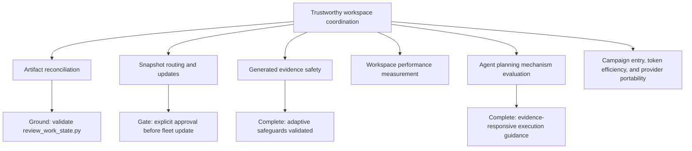

# Project Map: Tool Shed evolution

Status: active
Type: project-map
Updated: 2026-08-09
Next Action: exercise launcher runtime fallback in disposable Windows and Linux workspaces

## Purpose

Coordinate post-foundation Tool Shed improvements that change workspace routing, disconnected
snapshot updates, and the lifecycle of project-specific work artifacts.

## Visual Map

## Zoom Levels

30,000 ft:

- Overall outcome: Tool Shed stays aligned with project planning and can be safely refreshed across workspaces.
- Success shape: drift becomes visible without automatic rewrites, and snapshot updates preserve project work.

10,000 ft:

- Major workstreams: artifact reconciliation; request routing and guarded fleet
  snapshot updates; generated-evidence prevention and reversible migration; privacy-safe workspace
  performance measurement; evaluation and implementation of transferable planning mechanisms;
  campaign-entry discussion, adaptive coordination, token efficiency, and cross-provider product portability.
- Key dependencies: reconciliation must stabilize before its instructions are distributed to existing snapshots.

1,000 ft:

- Active workpackages:
  `work/wp/active/wp-tool-shed-routing-and-fleet-snapshot-updates.md` and
  `work/wp/active/wp-tool-shed-campaign-entry-improvements.md`.
- Completed workpackages include
  `work/wp/completed/wp-generated-evidence-safety-and-migration.md`.
- Completed workpackages: `work/wp/completed/wp-work-artifact-reconciliation.md`.
- Active ticket:
  `work/tickets/ticket-portable-verified-tool-shed-installer.md`.
- Completed performance ticket:
  `work/tickets/ticket-implement-privacy-safe-workspace-performance-profiler.md`.
- Completed planning-model evaluation:
  `work/spikes/spike-evaluate-human-planning-models-for-tool-shed.md`.
- Open decisions: whether reconciliation should become a strict CI gate after field use.

Ground:

- Current next action: obtain explicit approval before the first guarded fleet
  update.
- Owner/context: human and Codex in the canonical Tool Shed development workspace.
- Verification: focused unit tests plus `python3 scripts/validate_tool_shed.py`.

## Workstreams

| Workstream | Status | Lead Artifact | Depends On | Next Action |
| --- | --- | --- | --- | --- |
| Artifact reconciliation | complete | `work/wp/completed/wp-work-artifact-reconciliation.md` | existing index and stale-path checks | none |
| Snapshot routing and updates | active | `work/wp/active/wp-tool-shed-routing-and-fleet-snapshot-updates.md` | explicit approval; stable reconciliation guidance | hold before first fleet update |
| Generated evidence safety and migration | complete | `work/wp/completed/wp-generated-evidence-safety-and-migration.md` | imported incident and field-verification ticket | none |
| Portable verified installer | active | `work/tickets/ticket-portable-verified-tool-shed-installer.md` | stable-tag and provenance model; Windows/Linux matrix passed | exercise launcher runtime fallback in disposable Windows/Linux workspaces |
| Workspace performance measurement | complete | `work/tickets/ticket-implement-privacy-safe-workspace-performance-profiler.md` | completed profiling and fleet-measurement spike | gather approved longitudinal or multi-workspace measurements before proposing optimization |
| Agent planning mechanism evaluation | complete | `work/spikes/spike-evaluate-human-planning-models-for-tool-shed.md` | source-backed inventory and frozen instruction-level scenarios | none |
| Evidence-responsive execution | complete | `work/wp/completed/wp-evidence-responsive-tool-shed-execution.md` | published v0.11.0, exact installed-client parity, and fresh-task smoke | none |
| Campaign entry, token efficiency, and provider portability | complete | `work/wp/completed/wp-tool-shed-campaign-entry-improvements.md` | published v0.12.0, exact installed-client parity, and fresh-task smoke | run non-Codex runtime scenarios before increasing capability claims |

## Dependency Notes

- Reconciliation guidance must ship inside a reviewed snapshot before existing workspaces can use it.
- Fleet update remains a separate guarded operation and is not authorized by this workpackage.
- Generated-evidence improvements must pass varied disposable workspace profiles
  before they are distributed to existing workspaces.
- Migration apply work must remain gated by an exact manifest, verified archive,
  and human approval.
- Portable installer work must preserve stable-tag selection and two-commit
  provenance verification; cloning `main` is not an acceptable release source.

## Current Navigation

You are here:

- Generated-evidence safeguards are implemented and validated across representative
  workspace profiles.

Do next:

- [x] Finish focused reconciliation tests.
- [x] Run the complete repository validator.
- [x] Add a `ts: help` operator guide and skill route.
- [x] Add authoritative snapshot version and update-status checks.
- [x] Harden equal-version mismatch, version bumps, provenance, and plan-drift scope.
- [x] Complete the `0.2.0` pre-release hardening checklist.
- [x] Define workspace-profile fields, local-policy precedence, relative signals,
  and hard safety limits.
- [x] Treat the imported incident as one regression profile in a broader matrix.
- [x] Define and validate prepare-only and human-gated apply contracts.
- [x] Implement the stable-tag, cross-platform snapshot updater and rollback tests.
- [x] Verify the complete validator matrix in native Windows and Linux CI.
- [ ] Exercise launcher runtime fallback against disposable Windows and Linux workspaces.
- [ ] Review current-workspace findings with the human before any fleet update.
- [x] Define the workspace-performance report schema, privacy boundary, benchmark protocol, and fleet rollout plan.
- [x] Implement and canary the privacy-safe local workspace profiler.
- [x] Evaluate transferable human planning mechanisms and recommend proportionate Tool Shed updates.
- [x] Qualify, release, deploy, and fresh-task verify evidence-responsive execution guidance.
- [x] Finalize and implement the discussion route, adaptive token-efficiency, and cross-provider portability design.
- [x] Qualify existing-snapshot replacement and rollback for the compact Markdown skill layout.
- [x] Publish the qualified portability release, synchronize the installed Codex client, and fresh-task verify.

Avoid for now:

- Do not update other repositories or installed snapshots before explicit review and approval.
- Do not make the reconciliation command rewrite artifacts.
- Do not test migration against the original firmware workspace or mutate its
  evidence; use a disposable fixture.
- Do not combine current-snapshot cleanup with Git-history rewriting.

## Related Artifacts

- Work index: `work/index.md`
- Workpackages: `work/wp/completed/wp-work-artifact-reconciliation.md`,
  `work/wp/active/wp-tool-shed-routing-and-fleet-snapshot-updates.md`,
  `work/wp/active/wp-tool-shed-campaign-entry-improvements.md`,
  `work/wp/completed/wp-generated-evidence-safety-and-migration.md`,
  `work/wp/completed/wp-evidence-responsive-tool-shed-execution.md`
- Tickets: `work/tickets/ticket-field-verify-generated-evidence-safeguards.md`,
  `work/tickets/ticket-portable-verified-tool-shed-installer.md`,
  `work/tickets/ticket-implement-privacy-safe-workspace-performance-profiler.md`
- Checklists:
- Spikes:
- `work/spikes/spike-workspace-performance-profiling-and-fleet-measurement.md`
- `work/spikes/spike-evaluate-human-planning-models-for-tool-shed.md`
- Evidence:
- `work/evidence/evidence-tool-shed-provider-portability.md`
- `work/evidence/evidence-windows-nonprivileged-snapshot-upgrade.md`
- ADRs:
- Runbooks:
- Inventories:
- `work/inventories/inventory-human-planning-mechanisms-for-tool-shed.md`
- Decision matrices:
- `work/decisions/decision-human-planning-mechanisms-for-tool-shed.md`
