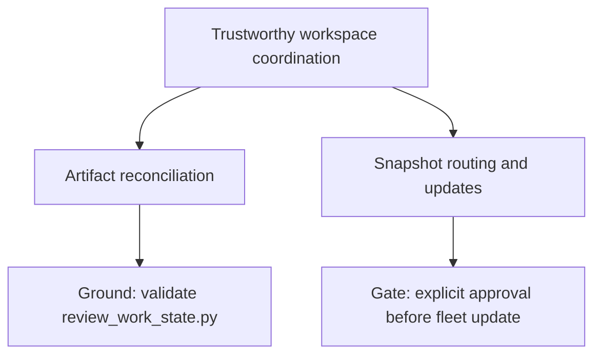

# Project Map: Tool Shed evolution

Status: active
Type: project-map
Updated: 2026-07-24
Next Action: obtain explicit approval before the first guarded fleet update

## Purpose

Coordinate post-foundation Tool Shed improvements that change workspace routing, disconnected
snapshot updates, and the lifecycle of project-specific work artifacts.

## Visual Map

## Zoom Levels

30,000 ft:

- Overall outcome: Tool Shed stays aligned with project planning and can be safely refreshed across workspaces.
- Success shape: drift becomes visible without automatic rewrites, and snapshot updates preserve project work.

10,000 ft:

- Major workstreams: artifact reconciliation; request routing and guarded fleet snapshot updates.
- Key dependencies: reconciliation must stabilize before its instructions are distributed to existing snapshots.

1,000 ft:

- Active workpackages: `work/wp/active/wp-tool-shed-routing-and-fleet-snapshot-updates.md`.
- Completed workpackages: `work/wp/completed/wp-work-artifact-reconciliation.md`.
- Active tickets: none.
- Open decisions: whether reconciliation should become a strict CI gate after field use.

Ground:

- Current next action: obtain explicit approval before the first guarded fleet update.
- Owner/context: human and Codex in the canonical Tool Shed development workspace.
- Verification: focused unit tests plus `python3 scripts/validate_tool_shed.py`.

## Workstreams

| Workstream | Status | Lead Artifact | Depends On | Next Action |
| --- | --- | --- | --- | --- |
| Artifact reconciliation | complete | `work/wp/completed/wp-work-artifact-reconciliation.md` | existing index and stale-path checks | none |
| Snapshot routing and updates | active | `work/wp/active/wp-tool-shed-routing-and-fleet-snapshot-updates.md` | explicit approval; stable reconciliation guidance | hold before first fleet update |

## Dependency Notes

- Reconciliation guidance must ship inside a reviewed snapshot before existing workspaces can use it.
- Fleet update remains a separate guarded operation and is not authorized by this workpackage.

## Current Navigation

You are here:

- Reconciliation implementation and documentation are in the validation stage.

Do next:

- [x] Finish focused reconciliation tests.
- [x] Run the complete repository validator.
- [x] Add a `ts: help` operator guide and skill route.
- [x] Add authoritative snapshot version and update-status checks.
- [x] Harden equal-version mismatch, version bumps, provenance, and plan-drift scope.
- [x] Complete the `0.2.0` pre-release hardening checklist.
- [ ] Review current-workspace findings with the human.

Avoid for now:

- Do not update other repositories or installed snapshots before explicit review and approval.
- Do not make the reconciliation command rewrite artifacts.

## Related Artifacts

- Work index: `work/index.md`
- Workpackages: `work/wp/completed/wp-work-artifact-reconciliation.md`, `work/wp/active/wp-tool-shed-routing-and-fleet-snapshot-updates.md`
- Tickets:
- Checklists:
- Spikes:
- ADRs:
- Runbooks:
- Inventories:
- Decision matrices:
