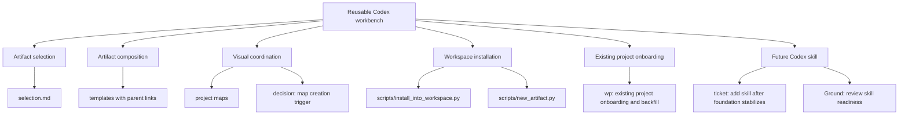

# Project Map: tool_shed foundation

Status: active
Type: project-map
Updated: 2026-07-05
Next Action: review future Codex skill readiness

## Purpose

Navigate `tool_shed` foundation work from the broad goal down to the next concrete edit, especially when the project has enough moving parts that text-only planning becomes hard to hold in working memory.

## Visual Map

## Zoom Levels

30,000 ft:

- Overall outcome: `tool_shed` is a reusable collaboration toolkit for structured Codex work.
- Success shape: Codex can pick the right artifact, compose artifacts across a large effort, and keep project state visible without turning the shed into a server or task tracker.

10,000 ft:

- Major workstreams: artifact selection, artifact composition, visual coordination, workspace installation, existing project onboarding, future Codex skill.
- Key dependencies: stabilize local Markdown/scripts before packaging behavior into a Codex skill.

1,000 ft:

- Active workpackages: none.
- Completed workpackages: `work/wp/completed/wp-existing-project-onboarding-and-backfill.md`.
- Active tickets: `work/tickets/ticket-add-codex-skill-after-foundation-stabilizes.md`.
- Open decisions: whether project maps need generated indexes, rendered diagrams, or stay plain Markdown/Mermaid for now.

Ground:

- Current next action: review whether the foundation is stable enough to design the future Codex skill.
- Owner/context: Codex and human working in `/home/jon/docker/tool_shed`.
- Verification: script syntax checks pass and generated map artifacts land under `work/maps/`.

## Workstreams

| Workstream | Status | Lead Artifact | Depends On | Next Action |
| --- | --- | --- | --- | --- |
| Artifact selection | active | `selection.md` | none | Keep examples aligned with real use |
| Artifact composition | active | `conventions.md` | stable artifact headers | Validate parent links in templates |
| Visual coordination | active | `templates/project-map.md` | Mermaid/plain Markdown viability | Use threshold trigger rule |
| Workspace installation | active | `scripts/install_into_workspace.py` | directory convention stability | Keep generated `work/README.md` aligned |
| Existing project onboarding | complete | `work/wp/completed/wp-existing-project-onboarding-and-backfill.md` | map trigger rule | None |
| Future Codex skill | deferred | `work/tickets/ticket-add-codex-skill-after-foundation-stabilizes.md` | foundation stability | Review readiness |

## Dependency Notes

- Existing project onboarding is complete enough for the foundation workflow.
- The Codex skill should wait until artifact selection, composition, visual coordination, and onboarding/backfill are stable enough to encode without churn.
- Project maps should stay light enough to remain useful as a navigation surface, not become a second project management system.
- Templates should support links between artifacts, but detailed work should remain in the artifact that fits it best.

## Current Navigation

You are here:

- Existing project onboarding/backfill is complete for the Level 2 foundation workflow.

Do next:

- [x] Validate `project-map` creation through `new_artifact.py`.
- [x] Confirm installer creates `work/maps/`.
- [x] Draft `work/decisions/decision-project-map-creation-trigger.md`.
- [x] Define backfill levels in `work/wp/completed/wp-existing-project-onboarding-and-backfill.md`.
- [x] Design the Level 2 existing-project onboarding workflow.
- [x] Test Level 2 onboarding on an existing project clone.
- [x] Decide whether Level 2 onboarding needs helper automation.
- [x] Test `scripts/onboard_existing_project.py` on an existing project clone.
- [x] Decide which discovered facts become `work/` artifacts versus settled `docs` or README updates.
- [ ] Review future Codex skill readiness.

Avoid for now:

- Do not build a server, database, renderer, or heavyweight tracker before plain Markdown and scripts fail.
- Do not add the Codex skill until the foundation is stable.

## Related Artifacts

- Workpackages: `work/wp/completed/wp-existing-project-onboarding-and-backfill.md`
- Tickets: `work/tickets/ticket-add-codex-skill-after-foundation-stabilizes.md`
- Checklists:
- Spikes:
- ADRs:
- Runbooks:
- Inventories:
- Decision matrices: `work/decisions/decision-project-map-creation-trigger.md`, `work/decisions/decision-level-2-onboarding-helper-automation.md`
