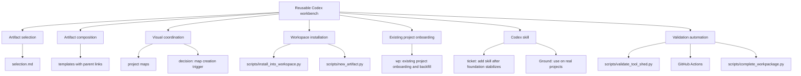

# Project Map: tool_shed foundation

Status: active
Type: project-map
Updated: 2026-07-05
Next Action: continue using tool_shed on real projects; revisit plugin packaging only if distribution friction appears

## Purpose

Navigate `tool_shed` foundation work from the broad goal down to the next concrete edit, especially when the project has enough moving parts that text-only planning becomes hard to hold in working memory.

## Visual Map

## Zoom Levels

30,000 ft:

- Overall outcome: `tool_shed` is a reusable collaboration toolkit for structured Codex work.
- Success shape: Codex can pick the right artifact, compose artifacts across a large effort, and keep project state visible without turning the shed into a server or task tracker.

10,000 ft:

- Major workstreams: artifact selection, artifact composition, visual coordination, workspace installation, existing project onboarding, future Codex skill.
- Key dependencies: stabilize local Markdown/scripts before packaging behavior into a Codex skill.

1,000 ft:

- Active workpackages: none.
- Completed workpackages: `work/wp/completed/wp-existing-project-onboarding-and-backfill.md`.
- Active tickets: none.
- Completed tickets: `work/tickets/ticket-add-codex-skill-after-foundation-stabilizes.md`.
- Open decisions: none.

Ground:

- Current next action: keep using `tool_shed` on real projects; revisit plugin packaging only if distribution friction appears.
- Owner/context: Codex and human working in `/home/jon/docker/tool_shed`.
- Verification: `python3 scripts/validate_tool_shed.py` passes locally and in GitHub Actions.

## Workstreams

| Workstream | Status | Lead Artifact | Depends On | Next Action |
| --- | --- | --- | --- | --- |
| Artifact selection | active | `selection.md` | none | Keep examples aligned with real use |
| Artifact composition | active | `conventions.md` | stable artifact headers | Keep completion and supersession guidance aligned |
| Visual coordination | complete | `templates/project-map.md` | Mermaid/plain Markdown viability | None |
| Workspace installation | active | `scripts/install_into_workspace.py` | directory convention stability | Keep generated `work/README.md` aligned |
| Existing project onboarding | complete | `work/wp/completed/wp-existing-project-onboarding-and-backfill.md` | map trigger rule | None |
| Codex skill | complete | `work/tickets/ticket-add-codex-skill-after-foundation-stabilizes.md` | foundation stability | Use on real projects |
| Validation automation | complete | `scripts/validate_tool_shed.py` | script test coverage | Monitor CI |

## Dependency Notes

- Existing project onboarding is complete enough for the foundation workflow.
- The Codex skill is installed locally and should remain a thin routing layer over workspace-local shed files.
- Project maps should stay light enough to remain useful as a navigation surface, not become a second project management system.
- Templates should support links between artifacts, but detailed work should remain in the artifact that fits it best.
- Validation now covers script compilation, unit tests, generated indexes, stale path scans, temp workspace smoke tests, template/example sanity, and GitHub Actions.

## Current Navigation

You are here:

- Existing project onboarding/backfill is complete for the Level 2 foundation workflow.
- The project map trigger decision is accepted and encoded in selection guidance.

Do next:

- [x] Validate `project-map` creation through `new_artifact.py`.
- [x] Confirm installer creates `work/maps/`.
- [x] Draft `work/decisions/decision-project-map-creation-trigger.md`.
- [x] Define backfill levels in `work/wp/completed/wp-existing-project-onboarding-and-backfill.md`.
- [x] Design the Level 2 existing-project onboarding workflow.
- [x] Test Level 2 onboarding on an existing project clone.
- [x] Decide whether Level 2 onboarding needs helper automation.
- [x] Test `scripts/onboard_existing_project.py` on an existing project clone.
- [x] Decide which discovered facts become `work/` artifacts versus settled `docs` or README updates.
- [x] Review future Codex skill readiness.
- [x] Choose Codex skill creation target.
- [x] Create repo-local skill package at `skills/tool-shed`.
- [x] Create installed local skill at `/home/jon/.codex/skills/tool-shed`.
- [x] Use the skill workflow on real project clones.
- [x] Evaluate plugin packaging after real use.
- [x] Add generated `work/index.md` and `work/index.json`.
- [x] Add stale work path checks.
- [x] Add validation runner and GitHub Actions.
- [x] Add active workpackage completion helper.

Avoid for now:

- Do not build a server, database, renderer, or heavyweight tracker before plain Markdown and scripts fail.
- Do not package a plugin until distribution friction appears.

## Related Artifacts

- Workpackages: `work/wp/completed/wp-existing-project-onboarding-and-backfill.md`
- Tickets: `work/tickets/ticket-add-codex-skill-after-foundation-stabilizes.md`
- Checklists: `work/checklists/checklist-tool-shed-skill-field-test.md`
- Spikes:
- ADRs:
- Runbooks:
- Inventories:
- Decision matrices: `work/decisions/decision-project-map-creation-trigger.md`, `work/decisions/decision-level-2-onboarding-helper-automation.md`, `work/decisions/decision-codex-skill-readiness.md`, `work/decisions/decision-plugin-packaging-readiness.md`
