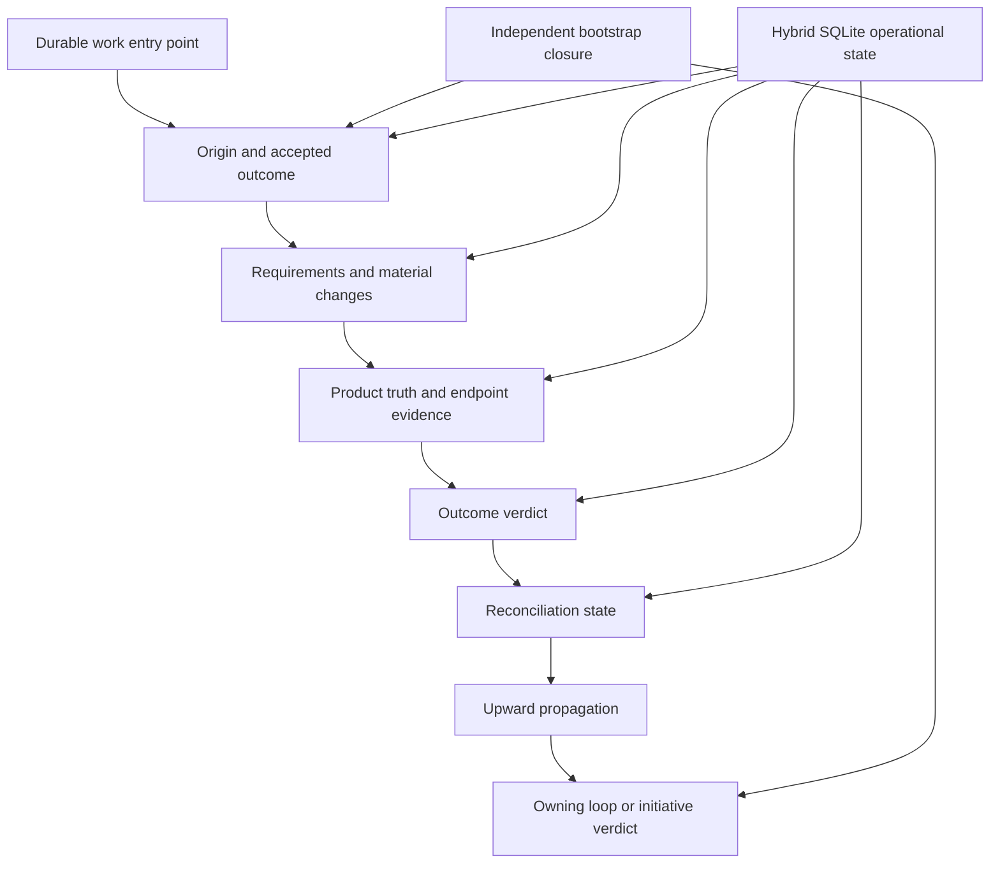

# Project Map: Universal Closed-Loop Outcome Reconciliation

Status: complete
Type: project-map
Updated: 2026-08-28
Next Action: none
Source Idea: work/ideas/idea-universal-closed-loop-outcome-reconciliation.md
Campaign: freeze-universal-closed-loop-contract-and-bootstrap

## Purpose

Deliver universal closed-loop outcome reconciliation as a Tool Shed lifecycle invariant without
changing the approved phase-one hybrid authority split. Every durable entry point must expose an
origin, accepted outcome, material changes, product truth, evidence, a truthful outcome verdict,
and reconciliation state; terminal child work and empty queues must propagate their result upward
instead of implying parent success.

## Visual Map

## Zoom Levels

30,000 ft:

- Overall outcome: Tool Shed can answer whether accepted work became true in the intended product
  and target, including approved development changes, regardless of the durable entry point.
- Success shape: lifecycle, outcome verdict, and reconciliation remain independent; every
  difference has an explicit disposition; result propagation prevents false parent completion;
  historical uncertainty is retained; and a released client proves the loop end to end.

10,000 ft:

- Major workstreams: independent bootstrap and semantics; generic reconciliation engine;
  lifecycle integration and compact reporting; migration/backfill and recovery; release and
  disconnected-client qualification.
- Key dependencies: released v0.34.2 hybrid substrate; existing HPT2 vertical slice; current
  campaign/roadmap/file authority; deterministic checkpoint and updater protocol 4.

1,000 ft:

- Active workpackages: none; delivery will use evidence-gated Program Roadmap campaigns.
- Active tickets: none.
- Open decisions: none that block schema-version-1 planning. The minimum contract is settled below;
  any later expansion of database authority or retirement of source files remains separate work.

Ground:

- Current next action: none; the mapped program is released, canary-qualified, and reconciled.
- Owner/context: Tool Shed maintainer workspace only; no Marshal or unrelated project artifacts.
- Verification: independent bootstrap ledger, focused unit/integration tests, file/SQLite parity,
  checkpoint rebuild, historical ambiguity fixtures, full Tool Shed validation, exact push CI,
  release provenance, and one zero-remote synthetic client canary.

## Workstreams

| Workstream | Status | Lead Artifact | Depends On | Next Action |
| --- | --- | --- | --- | --- |
| Independent closure and semantic contract | complete | this map and a bootstrap closure manifest | released hybrid substrate | none |
| Generic outcome-reconciliation engine | complete | `scripts/outcome_reconciliation.py` | semantic contract | none |
| Lifecycle and operator integration | complete | campaign/roadmap/doctor/index scripts and docs | generic engine | none |
| Backfill, recovery, and efficiency | complete | checkpoint/export and qualification evidence | engine and integration | none |
| Release and disconnected canary | complete | Program Roadmap release milestone | all prior gates | none |

## Dependency Notes

- The hybrid database remains operational authority only for phase-one structured identity,
  relationship, revision/event, requirement/change/evidence/verdict, and reconciliation fields.
- Campaigns, queues, roadmaps, milestones, gates, Idea Brief bodies, and general Markdown remain
  file-authoritative; integrations consume or project structured closure state without dual writes.
- An independent file/Git bootstrap ledger must remain capable of rejecting a false satisfied
  verdict while the feature being implemented is not yet trustworthy.
- Direct work may use a compact inline closure capsule; it must not gain mandatory heavyweight
  artifacts merely to satisfy the loop.
- Deterministic tooling may validate facts and exact manifests but cannot invent semantic verdicts,
  authorizations, relationships, or missing historical evidence.

## Current Navigation

You are here:

- The universal closed-loop program is complete: Tool Shed v0.35.0 is published, the maintainer
  skill is synchronized, a zero-remote synthetic client passed upgrade and reconciliation, and the
  originating Idea is satisfied and reconciled.

Do next:

- [x] Approve this project map with a fresh project-bound token.
- [x] Establish the independent bootstrap closure baseline.
- [x] Develop, propose, and approve the Program Roadmap.
- [x] Execute one milestone wave at a time through its evidence gate.
- [x] Reconcile the originating Idea Brief, released product, target canary, and final initiative
      verdict before declaring the PRM complete.

Avoid for now:

- Moving campaign, roadmap, Idea Brief, or general Markdown bodies into SQLite.
- Rewriting historical artifacts to manufacture uniform provenance.
- Fleet rollout, unrelated workspace upgrades, or retirement of retained source files.
- Treating terminal lifecycle state, a passing test, a release, or an empty queue as sufficient
  evidence of outcome satisfaction by itself.

## Related Artifacts

- Work index: work/index.md
- Source Idea Brief: work/ideas/idea-universal-closed-loop-outcome-reconciliation.md
- Hybrid project map: work/maps/map-hybrid-sqlite-operational-state.md
- Hybrid authority contract: docs/hybrid-sqlite-state-v1-contract.md
- Current vertical-slice documentation: docs/outcome-reconciliation.md
- Current engine: scripts/outcome_reconciliation.py
- Current qualification: tests/test_outcome_reconciliation.py
